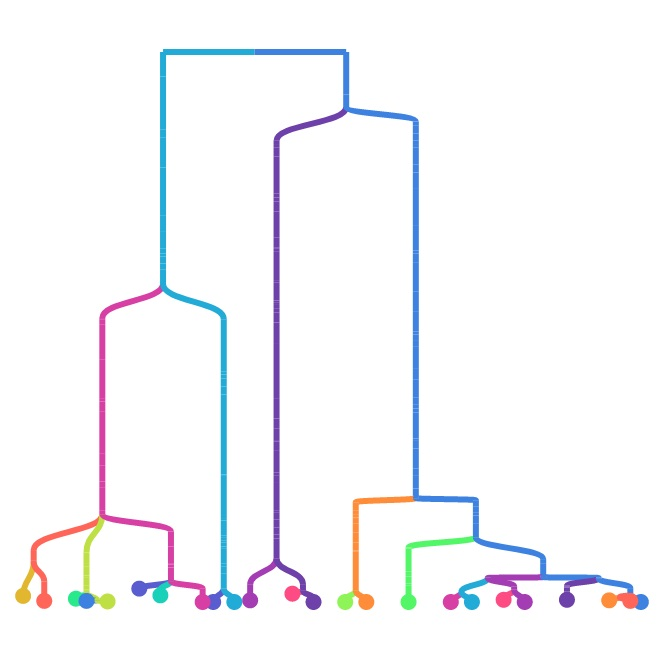
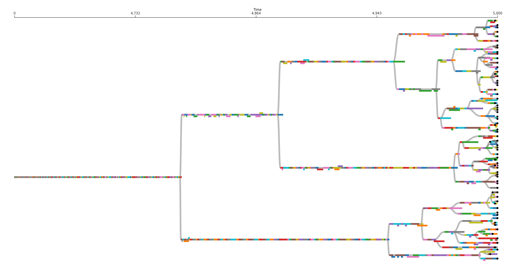

# Evolution tools

## Phylotracklib (Systematics Manager)

The systematics manager tracks phylogenetic relationships among organisms within a digital
evolution system. For asexual systems, these relationships forma phylogenetic tree
(phylogeny). Systems with recombination (i.e. sexual reproduction systems) are not
yet supported. One of the major benefits of doing *in silico* evolution experiments (instead of or in addition to laboratory or field experiments) is that they allow perfect measurement of quantities that can only be inferred in nature. Once such property is the precise phylogeny (i.e. ancestry tree) of the population.



At face value, measuring a phylogeny in *in silico* evolution may seem very straightforward: you just need to keep track of what gives birth to what. However, multiple aspects turn out to be non-trivial (see below). The Empirical systematics manager is designed to handle these challenges in a flexible way such that it can be easily plugged into any digital evolution system. It flexibly handle all aspects of recording phylogenies in *in silico* evolution.

Note: A python wrapper for systematics manager exists in the form of the [Phylotrackpy library](https://phylotrackpy.readthedocs.io/en/latest/).

### Features

#### Flexible taxon definitions

One of the central decisions when creating a phylogeny is choosing what the taxonomic units (i.e. the nodes in the tree) are. In a traditional phylogeny, these nodes are species. However, the concept of species is so murky that it is impossible to generically apply to computational evolution systems (we'd argue that it's questionable whether it could even be applied to biological data recorded at perfect temporal resolution, but that's a separate conversation). One alternative would be to make a phylogeny in which all nodes are individuals, but these trees are usually so large that they are impractical to work with.

Increasingly, biologists have embraced the idea of building trees in which the taxonomic units are not species. Often, these are denoted by referring to them as an "X tree", where X is the taxonomic unit of interest. A traditional phylogeny, then, is a species tree. This terminology is particularly common in cancer evolution research, in which species trees are often contrasted with "clone trees" or "gene trees", in which the taxonomic units are genotypes.

We can generalize this concept - any phylogeny of individuals can be abstracted by lumping individuals together based on a shared feature (see figure). This feature could be something simple like a phenotypic or genotypic trait, or it could be something more complex. For example, to approximate something more like a traditional biological species concept, you could choose to define an individual as being a member of a new taxonomic unit if it fails to produce successful offspring when recombined with an individual prototypical of its parent species (although note that the stochasticity inherent in this definition could have some unexpected side effects). The broader the grouping, the smaller the phylogeny will be (e.g. a genotype tree will be larger than a phenotype tree).


(Figure from "Quantifying the tape of life: Ancestry-based metrics provide insights and intuition about evolutionary dynamics" published in the proceedings of [ALIFE 2018](http://2018.alife.org/))

So how does the systematics manager handle this problem? By giving you the power to define taxonomic groupings however you want! When you construct a `Systematics` object, you give it a function that it can use to determine the taxonomic unit of an organism. Later, when organisms are born, you will pass them to the `Systematics` object and it will run that function on them. If the result matches the result of calling that function on the new organism's parent, then the organism will be considered to be part of the same taxonomic unit (taxon) as its parent. If the results do not match, the new organism will be considered to be the start of a new taxon descended from the parent's taxon.

Note that multiple taxa may evolve that are the "same" (i.e. running the function on organisms in each yields the same result); each unique evolutionary origin will be counted as a distinct taxon. For example, let's imagine we are building a phylogeny of real animals in nature and grouping them into taxa based on whether they spend more than 50% of their lives in water. Fish and whales would be parts of two different taxa. Even though they both live their whole lives in the water, there would be a "land" taxon in between them on the line of descent.

Example:

```cpp
#include "Systematics.hpp"

// Assuming that the org_t class has a member variable called genotype that stores
// its genotype, this will create a phylogeny based on genotypes
// The org_t template parameter is the type of the organisms living in your world.
// The info_t template parameter is the type of the piece of information you will
// return to indicate which organisms count as the same taxon.
// e.g. here, info_t should be whatever the type of org.genotype is.
sys = emp::Systematics<org_t, info_t> sys([](const org_t & org){return org.genotype;});
```

#### Pruning

Phylogenies can get very large. So large that they can cause you program to exceed its available memory. To combat this problem, phylogenies can be "pruned" so they only contain extant (i.e. not extinct) taxa and their ancestors. If the `store_outside` variable for a systematics object is set to `False` (the default), this pruning will happen automatically. If you truly want to keep track of every taxon that ever existed, you can do so by setting `store_outside` to `True`. If you want to keep track of some historical data but can't afford the memory overhead of storing every taxon that ever existed, an intermediate options is to periodically print "snapshot" files containing all taxa currently in the phylogeny.

#### Phylostatistics calculations

Phylogenies are very information-dense data structures, but it can sometimes be hard to know how to usefully compare them. A variety of phylogenetic summary statistics (mostly based on topology) have been developed for the purpose of usefully making high-level comparisons. The systematics manager has many of these statistics built-in and can automatically output them. It can even keep running data (mean, variance, maximum, and minimum) on each statistic over time in a highly efficient format.

Available statistics include:

- Mean/max/min/sum/variance pairwise distance
- Colless-like index (a variant of the Colless index adjusted for trees with multifurcations)
- Sackin index
- Phylogenetic diversity

#### Efficiency

Tracking phylogenies can be computationally expensive. We have sought to keep the computational overhead as low as possible.

We also provide the option to remove all taxa that died before a certain time point (the `remove_before` method). Use this with caution, as it will inhibit the use of many phylogenetic topology metrics. In extreme cases it may be necessary to keep your memory footprint sufficiently low, though.

If you need substantially higher efficiency (in terms of time or memory) or are working in a distributed computing environment (where having a centralized phylogeny tracker can pose a large bottleneck), check out the [hstrat library](https://github.com/mmore500/hstrat), which lets you sacrifice some precision to achieve lower computational overhead.

#### Flexible output options

At any time, you can tell the systematics manager to print out the full contents of its current phylogeny in a "snapshot" file. These files will be formatted according to the [Artificial Life Phylogeny Data Standard format](https://alife-data-standards.github.io/alife-data-standards/phylogeny.html). By default they will contain the following columns for each taxon: 1) unique ID, 2) ancestor list, 3) origin time, and 4) destruction time. However, you can add additional columns with the `add_snapshot_fun` method.

You can also print information on a single lineage.

### Useful background information

There are certain quirks associated with real-time phylogenies that you might not be used to thinking about if you're used to dealing with reconstructed phylogenies. Many of these discrepancies are the result of the very different temporal resolutions on which these types of phylogenies are measured, and the fact that the taxonomic units we work with are often at a finer resolution than species. We document some here so that they don't catch you off guard:

- **Multifurcations are real**: In phylogenetic reconstructions, there is usually an assumption that any multifurcation/polytomy (i.e. a node that has more than two child nodes) is an artifact of having insufficient data. In real-time phylogenies, however, we often observe multifurcations that we know for sure actually happened.
- **Not all extant taxa are leaf nodes**: In phylogenetic reconstructions, there is usually an assumption that all extant (i.e. still living) taxa are leaf nodes in the phylogeny (i.e. none of them are parents/offspring of each other; similar taxa are descended from a shared common ancestor). In real-time phylogenies it is entirely possible that one taxon gives birth to something that we have defined as a different taxon and then continues to coexist with that child taxon.
- **Not all nodes are branch points**: In phylogenetic reconstructions, we only attempt to infer where branch points (i.e. common ancestors of multiple taxa) occurred. We do not try to infer how many taxa existed on a line of descent between a branch point and an extant taxa. In real-time phylogenies we observe exactly how many taxa exist on this line of descent and we keep a record of them. In practice there are often a lot of them, depending on you define your taxa. It is unclear whether we should include these non-branching nodes when calculating phylogenetic statistics (which is why the systematics manager lets you choose whether you want to).



The above image represents an actual phylogeny measured from digital evolution. Each rectangle represents a different taxon. It's position along the x axis represents the span of time it existed for. Note that there are often sections along a single branch where multiple taxa coexisted for a period of time. Circles represent extant taxa at the end of this run.

### Glossary

Some useful terminology that might be useful in understanding the documentation (and especially the code base) for the systematics manager, particularly in light of the fact that different sub-fields of evolutionary biology tend to use different words in many of these contexts.

- **Taxon**: a generic word for a specific taxonomic unit. We use "taxon" as a generic term to represent a node in a phylogeny. For example, species are a common type of taxon to use when depicting portions of the phylogeny of life on earth. However, sometimes people choose to use higher-order types of taxa (e.g. genus, family, order, class, etc.) when they are trying to depict a larger swath of the whole phylogeny.
- **Taxa**: Plural of taxon.
- **Multifurcation/polytomy**: A node in a phylogeny that has more than two child nodes
- **Bifurcation**: A node in a phylogeny that has exactly two child nodes.
- **Non-branch node**: A node in a phylogeny with only one child node.
- **Leaf node**: A node in a phylogeny with no children.
- **Most Recent Common Ancestor (MRCA)**: The most recent node in a phylogeny that is a common ancestor of all nodes associated with extant taxa. If the phylogeny is pruned, there won't be any branch points before the MRCA (because any branches not leading to the MRCA would lead to taxa that are now extinct).
- **Coalescence events**: Occur when the most recent common ancestor changes (i.e. all descendants from one side of the deepest branch of the phylogeny have gone extinct). In the absence of diversity-preserving features coalescence events are expected to occur by chance with a frequency dependent on population size and spatial structure (but be careful of distributional assumptions). Observing coalescence less frequently than you would expect by chance can be an indication that ecological interactions are present (we have discussed this more [here](https://direct.mit.edu/artl/article/26/1/58/93272/Interpreting-the-Tape-of-Life-Ancestry-Based) and [here](https://direct.mit.edu/artl/article/25/1/50/2915/The-MODES-Toolbox-Measurements-of-Open-Ended)).

### Quickstart

#### Installation

The Systematics manager is part of Empirical. Because Empirical is header-only, you can include whichever parts of it you want. To just use the Systematics manager, you just need to include the Systematics.hpp header. Note that the Systematics manager depends on the result of Empirical, so you will need to download the entire library. Currently, we recommend using the mabe-systematics branch:

```bash
git clone --recursive git@github.com:devosoft/Empirical.git
cd Empirical
git checkout mabe-systematics
```

Then in your C++ file:

```cpp
#include "Evolve/Systematics.hpp"
```

To compile your code using the systematics manager, you will need to tell you compiler where to find Systematics.hpp with the `-I` flag (the below assumes you are compiling from the directory you cloned Empirical into; if you aren't, you will need to include the full path to Empirical):

```bash
g++ -IEmpirical/include/emp my_source_file.cc
```

#### Usage

##### Creating a systematics object

The first step in tracking a phylogeny with the systematics manager is to make a systematics object. The most important decision to make at this point is how to define taxa in your phylogeny (for more information, see the "flexible taxon definition" section under "features"). You can do so by passing a function to the systematics constructor which takes an organism object and returns a string that specifies a taxon.

For example, to build a phylogeny based on genotypes, you could do the following:

```cpp
#include "Evolve/Systematics.hpp"

struct MyOrg {
    std::string genotype;
};

// The first template argument is the type of your organisms
// The second template argument is the type of the piece of information you
// are using to differentiate taxa (here its a string because the genotype
// member variable of our organism struct is a string)
sys = emp::Systematics<MyOrg, std::string> sys([](const MyOrg & org){return org.genotype;});
```

There are a couple of other decisions that you also need to make at this point. The first is which set of taxa to store in the systematics manager. The defaults here are most likely what you want to use, but in case they aren't, the systematics manager can be told to store or not store the following sets of taxa:

- **active**: the taxa that still currently have living members. You almost certainly want to store these (without them you don't really have a phylogeny), but can technically disable them by setting the `store_active` keyword argument in the constructor to false.
- **ancestors**: the taxa that are ancestors of active taxa. You almost certainly want to store these too (without them you don't really have a phylogeny), but can technically disable them by setting the `store_ancestors` keyword argument in the constructor to false.
- **outside**: the taxa that are not in either of the other two groups (i.e. taxa that have gone extinct and all of their ancestors have gone extinct). If you store these, your phylogeny will get very large very fast, so doing so is generally not recommended. It is occasionally useful, though, so you can enable storing these taxa by setting the `store_all` keyword argument in the constructor to true.

The second decision is slightly trickier. Once you start adding organisms to the systematics manager, it will create `Taxon` objects associated with each one to keep track of which taxon it is part of. You will need to use these taxon objects when adding future organisms, to specify which taxon their parent was part of. If you have control over your organism class, it is likely that the easiest option is to add a `self.taxon` attribute and store the taxon there. However, if you cannot add arbitrary data to your organism class, keeping track of taxon objects can get annoying. For this reason, the systematics manager gives you the option of letting it manage them. To do so, it needs a way to map individuals to taxa (since its possible there are duplicate taxa, simply running the organism to taxon function again won't work). It achieves this mapping by keeping track of each organism's position in the population. Thus, to have the systematics manager keep track of taxon objects itself, you must set the `store_pos` keyword argument in the constructor to true. You must also use the position-based versions of add_org and remove_org, and make sure to notify the systematics manager if any organism ever changes position during its lifetime for any reason.

Once you have created the systematics object, you just need to do two things: 1) notify it when something is born, and 2) notify it when something dies.

##### Notifying the systematics object of births

You must notify the systematics manager of births using the `add_org` family of functions. These functions require that you provide the newly born organism as well as either the taxon object of its parent or the position of its parent (if the systematics manager is tracking positions).

Example of tracking taxa as object attributes (assume we're building on our example above, and already have created a systematics manager called `sys`):

```cpp
// Do whatever you would normally do to create your first organism
// Here, we're assuming we can just call a constructor called Organism()
MyOrg my_org;

// Notify systematics manager of this organism's birth
// This is the first org, so it doesn't have a parent
// so we do not pass a second argument/
// add_org will return a pointer to this organism's taxon object, which we
// store for future reference
emp::Ptr<emp::Taxon<std::string> > taxon = sys.AddOrg(my_org);

// Assume stuff happens here that leads to my_org having offspring
// Here, we'll pretend that our organism class has a Reproduce method that
// returns a new offspring organism. You should handle this however you
// normally would
MyOrg org_2 = my_org.Reproduce();

// Notify the systematics manager of org_2's birth. Since it has a parent,
// we pass the taxon of that parent in as the second argument
sys.AddOrg(org_2, taxon)

```

An example of tracking positions is coming soon. For now, feel free to contact us with questions!

##### Notifying the systematics object of deaths

You must notify the systematics manager of deaths using the `remove_org` family of functions.

As an example (again, building on the previous examples):

```cpp
// Assume stuff happens that causes my_org to die

// We notify the systematics manager that this has happened by calling remove_org
// Note that remove_org takes the taxon of the dead organism as an argument, not
// the organism itself
sys.remove_org(taxon)

```

### Taxon properties

Taxon objects maintain the following information:

- taxon ID# ``GetID()``
- details of organisms in the taxon ``GetInfo()``
- pointer to the parent group (will return a null pointer if the species was injected)  ``GetParent()``
- how many organisms currently exist in the group and how many total organisms have ever existed in the group ``GetNumOrgs()``   or ``GetTotOrgs()``
- how many direct offspring groups exist from this group and how many total extant offspring that exist from this taxa ``GetTotalOffspring()``
- how deep in the tree the node you are examining is ``GetDepth()``
- when did this taxon first appear in the population ``GetOriginationTime()``
- when did the taxon leave the population ``GetDestructionTime()``

### Systematics manager properties

A systematics manager object maintains the following information:

- Are we tracking a synchronous population? ``GetTrackSynchronous()``   ``SetTrackSynchronous()``
- Are we storing all taxa that are still alive in the population? ``GetStoreActive()``   ``SetStoreActive()``
- Are we storing all taxa that are ancestors of the living organisms in the population? ``GetStoreAncestors()``   ``SetStoreAncestors()``
- Are we storing all taxa that have died out, as have all of their descendants? ``GetStoreOutside()``   ``SetStoreOutside()``
- Are we storing any taxa types that have died out? ``GetArchive()``   ``SetArchive()``
- Are we storing the positions of taxa? ``GetStorePosition()``   ``SetStorePosition()``
- How many living organisms are currently being tracked? ``GetTotalOrgs()``
- How many independent trees are being tracked? ``GetNumRoots()``
- What ID will the next taxon have? ``GetNextID()``
- What is the average phylogenetic depth of organisms in the population? ``GetAveDepth()``
- To find the most recent common ancestor (MRCA)  use ``GetMRCA()``  or ``GetMRCADepth()``  to find the distance to the MRCA.

### Phylogeny metrics

Many different metrics can be used to quantify th topology of a phylogeny. For more information, see (Winters et al., 2013; Tucker et al. 2017).

The Empirical systematics manager can calculate

- Phylogenetic diversity (Faith, 1992)
- Taxon Distinctiveness (From Vane-Wright et al., 1991)
- Evolutionary Distinctiveness (Isaac, 2007) (mean, sum, and variance)
- Mean pairwise distance (Webb and Losos, 2000), which is equivalent to Average Taxonomic Diversity (Warwick and Clark, 1998, Tucker et al., 2016)
- Sum pairwise distance
- Variance pairwise distance
- Out-degree distribution
- Average origination time
- Colless-like Index (Mir, 2018, PLoS One)
- Sackin Index (Sackin, 1972; reviewed in Shao, 1990)
- Depth of most recent common ancestor
- Phenotypic volatility (Dolson et al., 2019)
- Unique taxa on lineage (Dolson et al., 2019)
- Mutation count along lineage (Dolson et al., 2019)
- Tree size
- Maximum depth

## API

<!-- API TOC -->
<!-- The above comment tells the API generator that this file has API docs. Don't remove it. -->
```{eval-rst}
.. toctree::
   :glob:

   api/*
```
