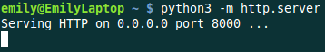
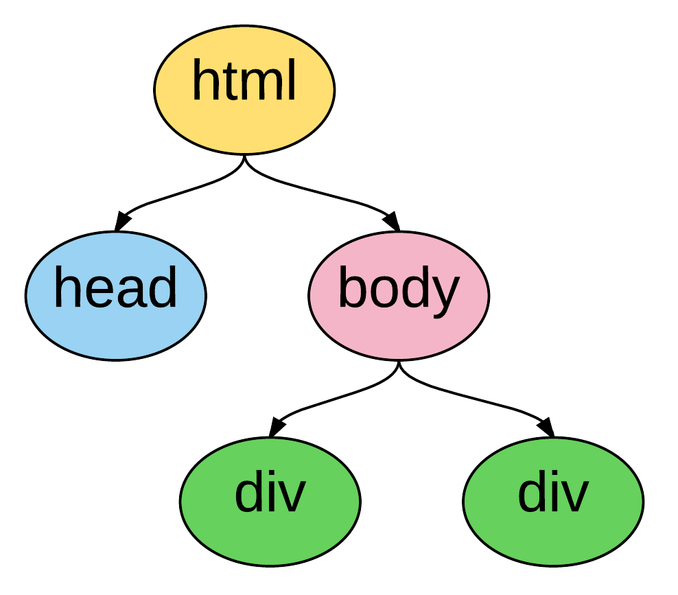

Using Empirical\'s D3.js Wrapper
================================

If you\'re writing scientific code that runs on the web, you\'ll
probably want to visualize the results (either as your program runs or
after it\'s done). To make this as easy as possible, Empirical includes
a C++ wrapper for d3.js, a wildly popular and powerful Javascript data
visualization library. Using the wrapper, you can create visualizations
directly from C++.

At a base level, the wrapper provides C++ equivalents for all objects,
methods, and functions in d3.js. So, if you\'re used to using d3, using
the wrapper should be very similar. However, d3.js is a library that you
use to build visualizations rather than a library of pre-built
visualizations (a fact that has lead to the proliferation of many very
similar libraries built on top of d3 that provide pre-built graphs).
Where possible, we have tried to provide short-cut functions and
pre-built graph objects in an effort to help those new to Javascript
visualization get started fast. This is an ongoing process and we\'re
always open to suggestions!

A Minimal Example
=================

D3 visualizations run in web browsers. That means that to use this
wrapper, you need to compile your C++ code to Javascript, using
Emscripten. To see the visualization, you need to have an html file that
loads your Javascript. Then you need to open that html file in a web
browser. Optionally, you might also have a CSS file that contains rules
for how elements of your web page should look.

This example assumes the following file structure:

{.align-center}

Here are the basics of what you need in order to get up and running. The
easiest way to make a visualization is to use one of the pre-built
visualizations. Later we\'ll get into writing your own. Either way,
you\'ll need:

C++ File
--------

The C++ file that you\'ll compile to Javascript. For this example,
we\'ll use the Empirical web module to build the whole web page:

``` cpp
// Always include web_init.h when you're doing web stuff -
// it makes sure everything gets initialized right
#include "../Empirical/include/emp/web/web_init.hpp"

// We're using a document object to arrange everything
// we're drawing.
#include "../Empirical/include/emp/web/Document.hpp"

//Contains pre-built visualizations
#include "../Empirical/include/emp/web/d3/visualizations.hpp"

// The document object is in charge of all of the Javascript
// and html that goes in the <div> element in the html. It
// gets created before main so that it stays in scope
// when main ends
emp::web::Document doc("my_visualization");

// The visualization object needs to be declared globally for
// the same reason. For this example, we'll use a
// LineageVisualization, which is a type of D3 visualization
// object. It takes two argumenets: the width and the height
// of the visualization.
emp::web::LineageVisualization lineage_viz(6000, 5000);

int main {
  // Add visualization to the document
  doc << lineage_viz;

  // Load pre-existing data file, example.json,
  // into the visualization
  lineage_viz.LoadDataFromFile("example.json");
}
```

Now we need to compile it:

``` bash
emcc my_program.cc -o my_program.js \ #.js extension tells Emscripten to compile to Javascript
     --js-library ../Empirical/include/emp/web/library_emp.js    \ #Include the Empirical Javascript library
     --js-library ../Empirical/include/emp/web/d3/library_d3.js  \ #Include Javascript library for D3 wrapper
     -s EXPORTED_FUNCTIONS="['_main', '_empCppCallback']" \ #Tells Emscripten what to export from C++
     -s ASSERTIONS=2 \ #Emscripten needs to know this
     -s DEMANGLE_SUPPORT=1 \ #Make names of variables in Javascript more readable
     -s TOTAL_MEMORY=67108864 \ #The exact number doesn't matter, but default is too small
     -s NO_EXIT_RUNTIME=1 \ #Make the page keep working after main() is done running
     -O3 -DNDEBUG #Turn on optimizations and turn off debugging (improves speed - only do this
                  #once you're done debugging)
```

HTML File
---------

To tell the browser what to do with your Javascript, you need an html
file:

``` html
<!-- This is an html comment -->
<!DOCTYPE html>
<html>

    <!-- The head is for stuff that needs to get set up first,
    like metadata and styles -->
    <head>
        <title> My D3/Empirical visualization! </title>

        <!-- Optional - load a stylesheet -->
        <link rel="stylesheet" type="text/css" href="style_sheet.css" />
    </head>

    <!-- Everything else goes in the body -->
    <body>
        <!-- Include necessary javascript libraries
        (jquery, d3, and a d3 tooltip library) -->
        <script src="Empirical/include/emp/web/jquery-1.11.2.min.js"></script>
        <script src="Empirical/include/emp/web/d3/d3.min.js" charset="utf-8"></script>
        <script src="Empirical/include/emp/web/d3/d3-tip.js" charset="utf-8"></script>

        <!-- Include the Javascript file you
        compiled your C++ code to -->
        <script src="my_program.js"></script>

        <!-- We told the emp::document that it was in charge of
        something called "my_visualization," so we need to create
        that element -->
        <div id="my_visualization"></div>

    </body>
</html>
```

CSS File
--------

Optionally, a CSS file can be used to make elements look the way you
want them to. Here\'s one that includes the necessary styles to make
tooltips work (the html file above assumes it\'s called
style\_sheet.css, and is in the same directory as the html file):

``` css
.d3-tip {
  line-height: 1;
  font-weight: bold;
  padding: 12px;
  background: rgba(255, 255, 255, 0.8);
  color: #000;
  border-radius: 2px;
}

/* Creates a small triangle extender for the tooltip */
.d3-tip:after {
  box-sizing: border-box;
  display: inline;
  font-size: 10px;
  width: 100%;
  line-height: 1;
  color: rgba(255, 255, 255, 0.8);
  content: "\25BC";
  position: absolute;
  text-align: center;
}

/* Style northward tooltips differently */
.d3-tip.n:after {
  margin: -1px 0 0 0;
  top: 100%;
  left: 0;
}
```

Running your visualization
--------------------------

Now to open up the page in a browser! Some browsers will let you open
the page up directly, but some will complain about the fact that you\'re
trying to access a file on your computer (example.json) with Javascript.
The easiest way around this is with the Python simpleHTTPServer library.
If you\'re using Python 2.x, run the following command from the
directory containing your html file:

``` bash
python -m SimpleHTTPServer
```

{.align-center}

If you\'re running Python 3.x, use this command instead:

``` bash
python -m http.server
```

{.align-center}

You can now open a browser to the server (<http://localhost:8000>,
replacing 8000 with whatever number was after \"port\" in the output
from the command). You should see a list of file names in the directory
your terminal was open to when you ran the HTTP Server command (unless
you happen to have a file named index.html, in which case you\'ll see
the contents of that file). Assuming you ran this command from the
\"example\" directory in the directory structure shown above, you should
see \"my\_html.html\" (or whatever you called your html file) on the
list. Click on it.

Ta-da! There\'s your visualization.

It\'s convenient to have a visualization of data you\'ve already
generated, but the real power of D3 visualization objects is that they
can update in real time while your code runs. Here\'s an example C++
file that does that:

> Example here

So that\'s how you use out-of-the-box D3 visualizations in Empirical.
Sometimes, though, you want to do something new and exciting. Which
brings us to the next section\...

Writing Your Own Visualization
==============================

To build your own visualization, you need to understand a bit about how
D3 works. Which means you need to understand a bit about how Javascript
and HTML work. I know, I know, the reason you\'re doing this all in C++
is that you want to avoid that, but I promise it\'s worth it if you want
to make interactive visualizations that run on the web.

When your browser loads a website, it takes the html for that page and
turns it into a tree:

{.align-center}

This tree is called the Document Object Model (DOM) and every set of
tags (things in angle brackets, like \<head\>\</head\>) in the html is
an element in it. Elements that are nested inside other elements are
represented as children of those elements in the tree. For instance, the
tree pictured above is representing the following html:

``` html
<!DOCTYPE html>
<html>
  <head>
  </head>
  <body>
    <div></div>
    <div></div>
  </body>
</html>
```

Javascript manipulates the DOM. It adds elements, it removes elements,
it moves them around, and it changes information about them. D3\'s
primary innovation is that it binds data to DOM elements and lets you
manipulate them based on that data. So, for instance, you can add a
bunch of circle elements representing all of your data points. With the
D3 C++ wrapper, you\'re doing the same thing, but from C++.

Let\'s take a tour of the main components of D3:

Selections
----------

`Selections <Selections_and_Transitions_API>`{.interpreted-text
role="ref"} are a way to work with groups of DOM elements. For instance,
let\'s say we have this html file:

``` html
<!DOCTYPE html>
<html>

    <head>
        <title> My D3/Empirical visualization! </title>
    </head>

    <body>
        <!-- Include necessary javascript libraries
        (jquery, and d3) -->
        <script src="Empirical/include/emp/web/jquery-1.11.2.min.js">
        </script>
        <script src="Empirical/include/emp/web/d3/d3.min.js" charset="utf-8">
        </script>

        <!-- Include the Javascript file you compiled your
         C++ code to -->
        <script src="my_program.js"></script>

        <div id="my_visualization">
          <svg id = "graph">
            <circle cx="10" cy="10" r="5">
            <circle cx="20" cy="20" r="5">
          </svg>
        </div>

    </body>
</html>
```

Notice that we\'ve added two types of elements: an SVG canvas and two
circles. SVG stands for Scalable Vector Graphics, which is the type of
graphics the D3 works with (the other type of graphics in Javascript are
canvas graphics). In SVG graphics, every shape is its own element,
nested inside an SVG canvas element, so each shape can be manipulated
independently. Here we have two circle elements on our SVG canvas.
We\'ve set three attributes for the circles: the x coordinate of their
center points (cx), the y coordinate of their center points (cy), and
their radii (r).

If we want to operate on the circles, we can create a selection object
that contains them:

``` cpp
//s is a container that contains both circle elements in the DOM
D3::Selection s = D3::SelectAll("circle");
```

We can then do things to all of the circles, like turn them purple:

``` cpp
// Set the "fill" style of everything in the s selection
// to "purple". "fill" is the color of the inside of a shape
// We'll talk more about modifying shapes a bit later
s.SetStyle("fill", "purple");
```

What if there are other circles outside the graph area that we don\'t
want to affect? We can select an element with a specific id using the
\"\#\", and then take a sub-selection by calling the
[SelectAll]{.title-ref} method on it:

``` cpp
// Select will create a selection containing the first matching
// element, whereas SelectAll creates a selection containing
// all matching elements
D3::Selection svg = D3::Select("#graph");
D3::Selection graph_circles = svg.SelectAll("circle");
```

Advanced note: You can also make selections based on classes with
[D3::Select(.classname)]{.title-ref}.

Binding Data
------------

In D3, you bind data to selections. Usually, you are binding that data
because you to visualize it with SVG elements. So, usually the selection
that we\'re binding data to is a selection of some type of SVG element
on an SVG canvas. Something like this:

``` cpp
// Here we're using D3 to add the svg canvas to the document.
// We could also have Selected a pre-existing svg canvas that
// we put in the html, as we did in previous examples.
D3::Selection svg = D3::Select("body").Append("svg");

D3::Selection data_points = svg.SelectAll("circle");
```

Wait, what? Why did we select all of the circles on the SVG canvas when
we know for a fact that there aren\'t any, because we just created it?
It turns out that D3 pays attention to the type of elements a selection
contains. It knows that this is an empty selection for circles. So now
we can bind our data to this selection and D3 will understand that each
point should correspond to a circle. That means it can tell which data
points don\'t have corresponding circles (in this case all of them).
These data points make up the \"enter selection,\" which we can access
with the [selection.enter()]{.title-ref} method. Most commonly, we use
the enter selection to append elements for every data point. Here\'s
what that all looks like together:

``` cpp
// Create example data
emp::vector<int> data = {1,2,3,4,5};

// Bind the data to the selection. We'll explain why this
// variable is named update in moment
D3::Selection update = data_points.Data(data);

// Get the enter selection (data without a DOM element)
D3::Selection enter = update.Enter();

// Give each data point in the enter selection a circle
// (as a shortcut, we could also have just used
// EnterAppend("circle") on the previous line)
enter.Append("circle");
```

Our circles won\'t show up if we don\'t give them cx, cy, and r
attributes. Let\'s set them to be equal to each element\'s corresponding
data value. We can do this by passing [SetAttr()]{.title-ref} a function
as its second object. Since passing functions around it much more common
in Javascript than in C++, we\'ll talk a bit more about the ins and outs
a bit later. For now, you just need to know that [SetAttr()]{.title-ref}
accepts a function that takes the data bound to the element and returns
the value you want to set an attribute to. Technically, Javascript is
going to pass it three arguements, so you should write your C++ function
to accept three parameters, or your compiler will probably throw a
tantrum:

``` cpp
// For now, we're going to use the simplest calllback function
// possible: one that returns exactly the data value that it
// was given.
std::function<int(int, int, int)> return_d = \
                            [](int d, int i, int j){return d;};

// Set cx (the x coordinate of the circle's center), cy (the y
// coordinate of the circle's center), and r (the radius) to
// all be the return of the return_d function
// (i.e. the bound data)
enter.SetAttr("cx", return_d)
     .SetAttr("cy", return_d)
     .SetAttr("r", return_d);
```

Now we have 5 circles, with the numbers from 1-5 bound to them as data
(one number per circle).

What if we get more data?

``` cpp
// Change data
data = {1, 2, 3, 4, 5, 6, 7};

// Select all of the circles and bind the new data
update = svg.SelectAll("circle").Data(data);

// This time the enter selection only contains two data points:
//  6 and 7
enter = update.Enter();

// Add new circles for the new data and set
// attributes appropriately
enter.Append("circle")
     .SetAttr("cx", return_d)
     .SetAttr("cy", return_d)
     .SetAttr("r", return_d);
```

Now we have 7 circles. We added circles for the ones that didn\'t
already have circles.

What happens if our dataset shrinks? We can use the
[selection.Exit()]{.title-ref} method. This returns the \"exit
selection\". In the same way the enter selection contains all of the
data points without circles, the exit selection contains all of the
circles without data points. Usually we want to remove them:

``` cpp
// Change data
data = {1,2,3,4};

// Select all of the circles and bind the new data
update = svg.SelectAll("circle").Data(data);

// The enter selection would be empty, but the exit
// selection has three things in it: 5, 6, and 7
exit = update.Exit();

// Remove everything in the exit selection from the DOM
// (as a shortcut, we could have just used ExitRemove()
// on the previous line)
exit.Remove();
```

Now we\'re down to four circles.

What happens if our data is replaced with four completely different
numbers? The enter and exit selections will be empty (every data point
has a circle and every circle has a data point), but the circles\'
attributes won\'t correspond to the right data anymore. Now it\'s
finally time to use that \"update\" variable we keep making. That
variable has been holding what\'s called the \"update selection.\" The
update selection is directly returned by the
[selection.data()]{.title-ref} method, and it contains all of the data
points associated with circles that already existed before the data was
bound. We can use it to re-set the circles\' attributes, based on the
new data:

``` cpp
// Change data
data = {10, 11, 12, 13};

// Select all of the circles and bind the new data
update = svg.SelectAll("circle").Data(data);

// Reset the attributes of the update selection
update.SetAttr("cx", return_d)
      .SetAttr("cy", return_d)
      .SetAttr("r", return_d);
```

Congratulations! You\'ve now used d3\'s popular enter-update-exit
pattern. For a more thorough discussion, see \[this
article\](<https://bost.ocks.org/mike/join/>) by the creator of d3.js.

There\'s one other thing you should know about binding data. Thus far,
we\'ve been matching data with DOM elements sequentially (the first data
point in the array gets paired with the first circle in the selection,
and so on). But sometimes you\'d like to keep the same circle
corresponding to the same data point (this is especially important if
you\'re applying transitions). To acheive this, you can pass
[selection.Data()]{.title-ref} a \"key\" function that takes a piece of
data (and optionally a position in the array/selection) and returns a
string. Data points are then matched with DOM elements based on whether
the string returned by running the function on the data point matches
the string returned by running the function on the data bound to the
element.

``` cpp
// Change data (re-arrange three elements and replace the fourth)
data = {13, 12, 11, 8}

// Select all of the circles and bind the new data with a key
// function. The key function supplied here is a lambda
// function that, like the return_d function
// we already wrote, just returns the value of the bound data
// The update selection contains circles for 11, 12, and 13,
// still associated with the correct data (so we don't need
// to reset the attributes)
update = svg.SelectAll("circle")
            .Data(data, [](int d, int i){return d};);

// The enter selection contains 8
// EnterAppend just combines Enter() and Append()
// In Javascript, it's common to chain methods, as is
// done below. Most Selection methods in the D3 wrapper
// return the selection, so that we can chain methods here too
// The code below does exactly the same thing we did to the
// other enter selections
update.EnterAppend("circle")
      .SetAttr("cx", return_d)
      .SetAttr("cy", return_d)
      .SetAttr("r", return_d);

// The exit selection contains 10
update.ExitRemove();
```

Changing Elements\' Traits
--------------------------

There are three types of traits that a DOM element might have:
attributes, styles, and properties. For the most part, attributes are
fundamental pieces of information about the element, styles deal with
the element\'s appearance (they are all things you could set with CSS),
and properties are rare and specific to certain types of elements. The
distinction mostly only matters because it determines which functions
you call to set and get the values of a trait. Here are some examples of
commonly used traits in each category:

**Attributes (use SetAttr()):**

-   **id** - an element\'s unique identifier
-   **width** - in pixels, by default
-   **height** - in pixels, by default
-   **x** - the location of an element on the x axis (in pixels)
-   **y** - the location of an element on the y axis (in pixels)
-   **cx** - the location of a circle\'s center on the x axis (in
    pixels)
-   **cy** - the location of a circle\'s center on the y axis (in
    pixels)
-   **r** - a circle\'s radius (in pixels)
-   **transform** - a string indicating how to position the element. The
    Move and Rotate methods of selections are a convenient shortcut for
    this.

**Styles (use SetStyle()):**

-   **fill** - the color an SVG shape is filled with
-   **stroke** - the color of a line (either the border of an SVG shape
    or a path object)
-   **stroke-width** - the length of a path or SVG shape border

**Properties (use SetProperty()):**

-   **checked** - a property indicating whether or not a checkbox is
    checked

All of these functions take two arguemnts: a string indicating the name
of the trait being changed and the value to change it to. This vale can
be a constant, such as a number, string, or color (depending on the
trait). They also accept functions (simple example above, explained in
more detail below) that allow you to set the trait based off of each
element\'s bound data. Javascript will pass these functions three
parameters: the value bound as data, the index of the element in the
selection, and a third element that we don\'t currently have a good way
to translate to C++ (use an int as a placeholder in your function
definition so C++ doesn\'t throw a tantrum).

Transitions
-----------

One of the most powerful parts of D3 is the ease with which it allows
you to animate your data. This is accomplished with
`transitions <Selections_and_Transitions_API>`{.interpreted-text
role="ref"}. The most common way to make a transition is to call the
[selection.MakeTransition()]{.title-ref} method on a selection
containing all of the elements you want to animate (note: in Javascript,
the method is just selection.transition(), because Javascript is less
finicky about name collisions). You can then use the
[attr()]{.title-ref} and [style()]{.title-ref} methods on the
transition, just as you would on a selection, and the change will be
animated. Note that the wrapper also allows you to set properties, html,
and classes on a transition, but D3 doesn\'t know how to animate changes
in these, so they will just happen at the end of the transition. Other
operations, such as appending new elements, are not allowed on
transitions, because there isn\'t a clear way to animate them.

For instance, here\'s an example of animating a circle moving across the
screen and gradually changing color from black (default) to blue:

``` cpp
// Add an svg canvas to the body and set its width to 100 pixels
D3::Selection svg = D3::Select("body").Append("svg")
                                      .SetAttr("width", 100);

// Put a circle on the canvas
D3::Selection circle = svg.Append("circle");

// The circle will only show up if we give it x and y coordinates
// for it's center, and a radius Since we're going to move it
// from the left side of the screen to the right, we'll start it
// centered at 0, the left edge (it will be half of the canvas)
circle.SetAttr("cx", 0).SetAttr("cy", 5).SetAttr("r", 5)

// Make a transition from the circle selection
D3::Transition circle_anim = circle.MakeTransition();

// By changing the "cx" attribute via the transition, we cause
// the change to be animated, so we see the circle moving across
// the screen. Similarly, we see the circle fade from black
// to blue.
circle_anim.SetAttr("cx", 100).SetStyle("fill", "blue");
```

Some functions in Empirical\'s D3 wrapper that accept selections will
also select transitions, allowing you to choose to have their effects be
animated, rather than occuring instantaneously (which can look choppy in
many visualizations).

Scales and Axes
---------------

Usually your data is not in units that you can directly draw on the
screen. For instance, if you want to plot a variable on the Y axis that
has values from -1 to 1, you\'ll need a way to convert from these very
small values to values representing where the elements of your
visualization should appear on the SVG canvas (in pixels). This is what
`scales <Scales_API>`{.interpreted-text role="ref"} do. Like a number of
other objects in D3, scales are actually functions. They accept a value
in the domain (the range of values your data can have) and return a
value in the range (the range of coordinates on your screen that you
want data to show up in).

For example, lets say we have data ranging from 0 to 1 and we want to
convert it to coordinates on our screen from 0 to 100. We can make a
scale to do it:

``` cpp
// Make a scale. We'll use a LinearScale, but you could also use
// an IdentityScale, LogScale, or PowScale
D3::LinearScale y_scale = D3::LinearScale();

// Set domain (possible input values)
y_scale.SetDomain(0, 1);

// Set range (possible output values)
y_scale.SetRange(0, 100);

// Convert value from domain to range
// This will be 100
double result = y_scale.ApplyScale(1);

// This will be 0
result = y_scale.ApplyScale(0);

// This will be 50
result = y_scale.ApplyScale(.5);

// Example data
emp::vector<int> data = {.1, .2, .3, .4, .5};

// Add SVG canvas to body, set its height to 100 (so our data
// fits)
D3::Selection svg = D3::Select("body")
                        .Append("svg")
                        .SetAttr("height", 100);

// make empty selection for circles,
// bind data to selection, and append circles for data
svg.SelectAll("circle")
   .Data(data)
   .Append("circle");

// Set y coordinate of circle centers based on y_scale
// Input to this function is the bound data, the index
// of the circles in the selection, and a placeholder
// value. Here, we use a lambda function, as it is a
// convenient way to put the y_scale in the proper scope.
circles.SetAttr("cy", [&y_scale](int d, int i, int j){
                        return y_scale.ApplyScale(d);
                    });

// Set cx and r so circles show up
circles.SetAttr("cx", 5).SetAttr("r", 3);
```

Great - we\'ve used a scale to plot our data. But how are we supposed to
know what the original data values were, now? With an
`axis <Axes_API>`{.interpreted-text role="ref"} object! Axes are a way
of creating a visual representation of a scale:

``` cpp
// Make an axis object, templated off of
// the type of scale we're depicting
// We pass the constructor a string to tell it
// how to label the axis.
D3::Axis<D3::LinearScale> ax = D3::Axis<D3::LinearScale>("yvar");

// Set the axis to use our y scale
ax.SetScale(y_scale);

// This is a y axis, so we probably want it oriented
// vertically with the numbers and label on the left
ax.SetOrientation("left");

// Draw the axis onto our SVG object
ax.Draw(svg);
```

If you\'re drawing both x and y axes, you may want to try using
[DrawAxes()]{.title-ref}, which attempts to make a smart guess about
where to place them.

You\'re not limited to working with numbers when you use scales. If you
provide strings with color names (or hex representations), the scale
will return an appropriately interpolated color. You can even provide an
array of more than two numerical values to domain, and an array
containing an equal number of colors to range, and D3 will interpolate
appropriately. If you don\'t want a continuous range of colors, try a
categorical scale. The [Category10Scale]{.title-ref} will assign colors
to up to 10 different categorical values. The
[Category20Scale]{.title-ref} can handle 20.

Passing Functions as Arguments
------------------------------

In Javascript, it\'s very common to pass functions as arguments to other
functions in order to customize their behavior. This comes, in part,
from the fact that a lot of Javascript code is exectured asynchronously.
Since the goal of most Javscript is to run a web page, Javascript needs
to respond to events such as user interactions (clicking, scrolling,
etc.). It also needs to avoid delaying everything on the page just
because there\'s a picture it\'s trying to load from a server that\'s
down. As a result, functions that require waiting for something to
happen often accept a \"callback function\" as an argument. This
function will get run when the function it was passed to is done. This
way of programming can take some getting used to for people who are more
used to more linear programming languages, but it\'s hard to avoid when
writing web code.

D3.js makes heavy use of functions-as-arguments. Most commonly, this
happens when you\'re trying to set attributes of graphical elements
based on the data that is bound to them (as demonstrated in the section
on binding data); you pass a function that takes a piece of data as an
argument and returns the attribute value.

In Empirical, there are a number of ways to pass functions as arguments
into d3 methods:

-   Write the callback function as a regular C++ function, a [C++ lambda
    function](http://en.cppreference.com/w/cpp/language/lambda), or a
    [std::function
    object](http://en.cppreference.com/w/cpp/utility/functional/function)
    and pass it into the d3 method.

``` cpp
int times_two(int d, int i, int j) {return d*2;};

int main() {
  // Create an empty selection for circles on an svg canvas
  // (assumes svg is already created). Bind data [1,2,3]
  // to selection, and add a circle for each data point
  D3::Selection s = Select("svg")
                      .SelectAll("circle")
                      .Data(emp::vector({1,2,3}))
                      .EnterAppend("circle");

  // We can use either of the following two lines to set
  // the circles' radii to be equal to two times their
  // data point (1, 2, or 3). Here we use a normal C++
  // function (could also be a std::function object)
  s.SetAttr("r", times_two);

  // Javascript will pass this function three things: the
  // data (d) bound to an element (an int, in this case),
  // an int (i) indicating the position of the element in
  // the selection, and a third item that you
  // don't need to worry about yet, but that requires an
  // int parameter (j) as a placeholder
  s.SetAttr("r", [](int d, int i, int j){return d * 2;});
```

-   Pass the d3 method a string containing the name of a function that
    exists in Javascript (either one that has been created by empirical,
    one that you defined globally on the current webpage, or a d3
    built-in function).

``` cpp
// For instance, if we wanted to sort our selection from
// the previous example, we could use d3's built-in
// "ascending" function:
s.sort("ascending");
```

-   If you\'re going to be repeatedly using a C++ function as a
    callback, you may improve the efficiency of your code by combining
    the two previous approaches, using Empirical\'s
    `JSWrap <JSWrap>`{.interpreted-text role="ref"} function.

``` cpp
// Creates a function in Javascript called "times_two"
// that calls times_two
emp::JSWrap(times_two, "times_two");

// Call the Javascript version of times_two
s.SetAttr("r", "times_two");
```

-   Advanced users may also wish to write functions directly in
    Javascript, which is possible using Emscripten\'s macros.

``` cpp
// Put the function in global scope by adding it
// to the current window
EM_ASM({window["times_two"] = function(d, i, j){return d*2;};});

// Call the Javascript version of times_two
s.SetAttr("r", "times_two");
```

All of these examples have assumed that the data points you\'ve bound to
your selection are ints. But most real-world data points are more
complex than that (e.g. they may contain values for multiple variables).
Javascript handles such data nicely by using [JSON
objects](https://developer.mozilla.org/en-US/docs/Web/JavaScript/Reference/Global_Objects/JSON).
You can write functions in C++ that accept JSON data from Javascript,
but you have to tell C++ what data it should be expecting. An Empirical
feature called
`introspective tuple structs <tuple_struct>`{.interpreted-text
role="ref"} provide a convenient way to do that, which JSWrap
understands.

``` cpp
struct JSONData {
  EMP_BUILD_INTROSPECTIVE_TUPLE( int, x,
                                 int, y,
                                 std::string, name
                                )
};

int get_x(JSONData d, int i, int j) {return d.x();};

// Assume s is a selection with a dataset already bound to it,
// and that that dataset contains JSON objects with the
// attributes described in the JSONData struct (x, y, and name).
// Set the "cx" attribute of the circle (the x position of the
// circle on your screen, in pixels) to the return of calling
// get_x on the data bound to each circle (i.e. the x value
// stored in the data point bound to a given circle)
s.SetAttr("cx", get_x);
```

Under the Hood (for the curious, developers, and people trying to do weird stuff)
=================================================================================

For the most part, Empirical\'s d3 wrapper isn\'t that complicated under
the hood. All C++ objects in the d3 module have a unique integer id.
Most of them don\'t actually store much more information. Instead, they
serve as an interface to an object stored in Javascript. All Javascript
objects that are being represented in C++ are stored in a Javascript
array called [js.objects]{.title-ref}. An object\'s id is actually the
index of the corresponding Javascript object in the
[js.objects]{.title-ref} array. Methods of that object reach into
Javascript and call the corresponding method on the appropriate object.
Some higher-level functions may call more than one d3 function.

The other piece of complexity that is hidden from the user is the
translation between JSON objects in Javascript and objects created with
EMP\_BUILD\_INTROSPECTIVE\_TUPLE. This is all handled by
`JSWrap <JSWrap>`{.interpreted-text role="ref"}, which identifies
objects created with EMP\_BUILD\_INTROSPECTIVE\_TUPLE by looking for a
member called n\_fields. n\_fields is created by
EMP\_BUILD\_INTROSPECTIVE\_TUPLE and indicates how many fields an object
has. All conversion from C++ functions to javascript functions is
handled by JSWrap (if you pass a function directly to a d3 method,
JSWrap is called behind the scenes). This is why it is potentially more
efficient to wrap functions once and pass the Javascript name as a
string than to keep passing them as C++ functions and re-wrapping them
every time. Rigorous tests on how much of a slow-down this introduces
have not been conducted.

Things to watch out for:

-   D3 object creation order - be careful of the order your constructors
    for d3 objects get called in. It\'s hard to make this happen, but if
    you\'re constructing objects in the constructors for other objects,
    it\'s possible for the ids to get mixed up.
-   Errors in Javascript usually won\'t show up on compilation - you
    need to actually run the code.
-   Main is a function that gets run like any other. When main finishes
    running, its local variables will go out of scope. This means that
    everything needed for an ongoing animation needs to live in global
    scope.
-   Javascript is designed to work asynchronously in a lot of contexts
    (especially when loading outside resources or updating the graphics
    on the screen). This can change the way you need to structure your
    code.
